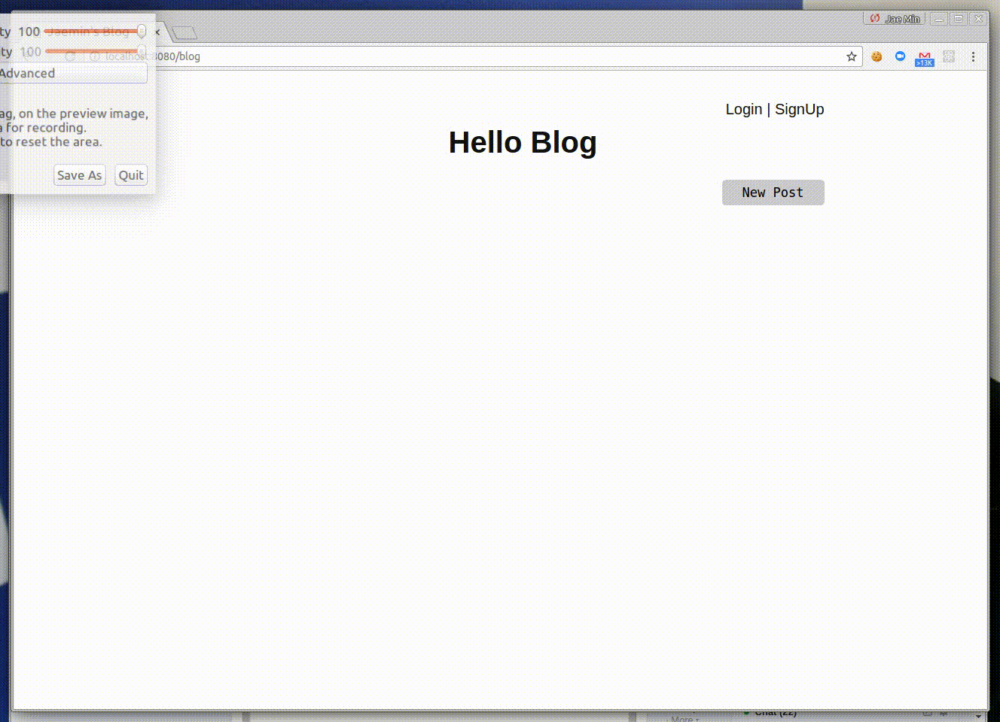
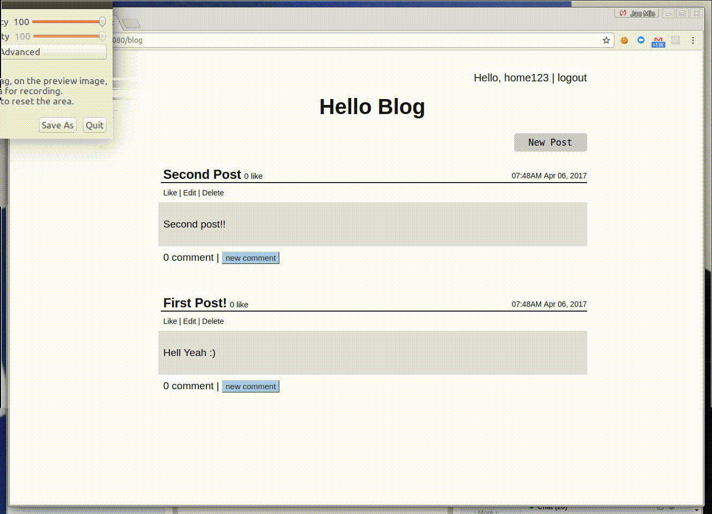
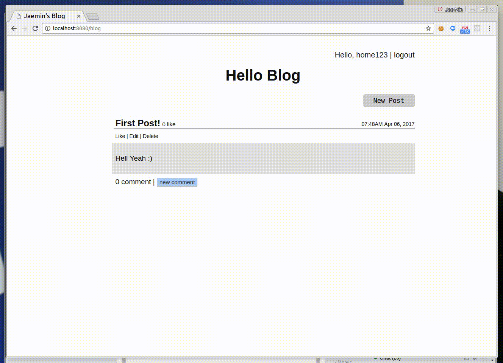

Blog Page
============
This is simple blog page.
The two main technologies used in this project are Google App Engine and Jinja. 
This project is part of Full Stack Web Development Nanodegree

## Feature
### Main Page

### Edit / Delete

### Comment 

## Use Case
1. Create a Basic Blog
* Front page that lists blog posts.
* A form to submit new entries.
* Blog posts have their own page.

2. Add User Registration
* Have a registration form that validates user input, and displays the error(s) when necessary.
* After a successful registration, a user is directed to a welcome page with a greeting, “Welcome, [User]” where [User] is a name set in a cookie.
* If a user attempts to visit the welcome page without being signed in (without having a cookie), then redirect to the Signup page.
* Be sure to store passwords securely.

3. Add Login
* Have a login form that validates user input, and displays the error(s) when necessary.
* After a successful login, the user is directed to the same welcome page from Step 2.

4. Add Logout
* Have a logout form that validates user input, and displays the error(s) when necessary.
* After logging out, the cookie is cleared and user is redirected to the Signup page from Step 2.

5. Add Other Features 
* Users should only be able to edit/delete their posts. They receive an error message if they disobey this rule.
* Users can like/unlike posts, but not their own. They receive an error message if they disobey this rule.
* Users can comment on posts. They can only edit/delete their own posts, and they should receive an error message if they disobey this rule.

## How to Run
1. Install [Python](https://www.python.org/downloads/)
2. Install [Google App Engine SDK](https://cloud.google.com/appengine/downloads#Google_App_Engine_SDK_for_Python)
3. Download or clone the whole file 
4. open your terminal in the folder which has the downloaded files 
5. type "dev_appserver.py app.yaml" on terminal
6. open your browser and access to "localhost:8080/blog"
